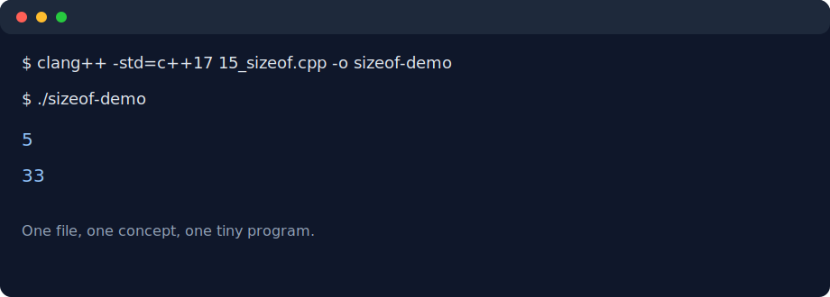

# C++ Basics

Short standalone C++ examples written while learning the language. The files are
numbered in the order they were practiced, from variables and constants to loops,
arrays, `sizeof`, and random number generation.



## Topics currently covered

| Files | Topic |
| --- | --- |
| `01_variables.cpp`, `02_constants.cpp` | variables and constants |
| `03_increment_decrement.cpp`, `04_operators.cpp` | operators |
| `05_if_else.cpp`, `06_switch.cpp` | conditional branching |
| `07_while.cpp`, `08_do_while.cpp`, `09_for.cpp` | loops |
| `10_break_continue.cpp`, `11_goto.cpp`, `12_nested_loop.cpp` | flow control |
| `13_arrays.cpp`, `14_arrays_loop.cpp`, `15_sizeof.cpp` | arrays |
| `16_rand_srand_ctime.cpp` | pseudo-random numbers |

## Build and run

Each file has its own `main()` function, so compile one file at a time:

```bash
clang++ -std=c++17 -Wall -Wextra -pedantic 14_arrays_loop.cpp -o arrays-loop
./arrays-loop
```

To check every example:

```bash
for file in *.cpp; do
  clang++ -std=c++17 -Wall -Wextra -pedantic "$file" -o /tmp/cpp-basics-check
done
```

## Notes

This repository intentionally focuses on small examples rather than a single
application. More advanced topics such as functions, pointers, classes, and STL
containers are not present yet.
